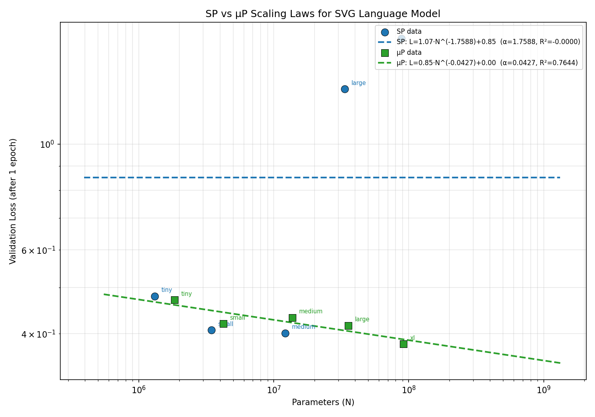

## Hi, I'm Yusuke

Software engineer with 12 years of experience in web development (Rails / React / AWS), currently expanding into machine learning and deep learning.

### Featured Project

#### [Scaling Laws for Language Models on SVG Code](https://github.com/katsukii/svg-scaling-project)

An empirical study of neural scaling laws applied to SVG code generation. Trained GPT-style models (1.3M-88M params) on 107M tokens of SVG data and fit power-law curves to characterize how loss scales with model size. Compared Standard Parameterization with muP for zero-shot learning rate transfer.

**Tech:** Python, PyTorch, muP, BPE tokenization, power-law fitting

[Project Page](https://katsukii.github.io/svg-scaling-project/) | [Full Report (PDF)](https://katsukii.github.io/svg-scaling-project/report.pdf) | [Repository](https://github.com/katsukii/svg-scaling-project)
